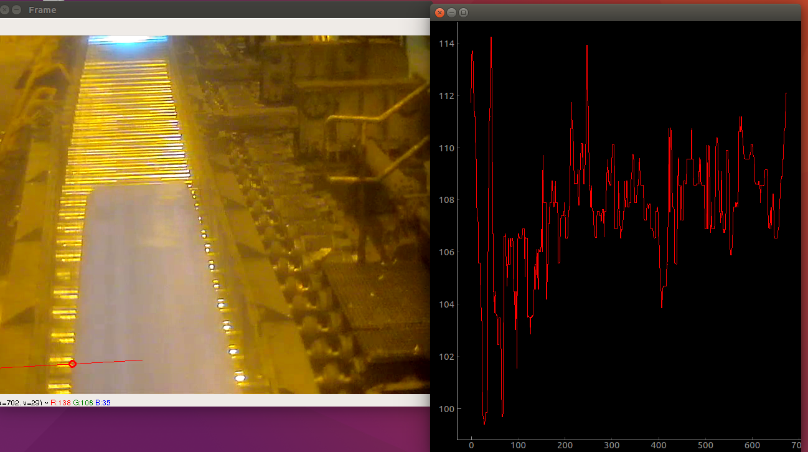

# Telescopicity

This is another colorful and funny project. Colorful because the output is tangible, you can show to another mortals what you've done, and funny because I had to use cool transformations. In this case the objective was to measure the deviance of the iron that was going through a tape, a camera that was filming the process let me catch it and apply some transformation in order to detect the border of that film and then measure the distance to the center. 

The steps for the detection where: Blur -> Canny filter (edge detection) -> Hough transform (generate lines). The problem here was that Hough throws me a lot of lines so the criteria to decide of just a median filter. After that, the camera was a bit rotated so that final step was to apply simple algebra to measure the pixels to the center of the tape.

Here's a photo that shows how it works :)

